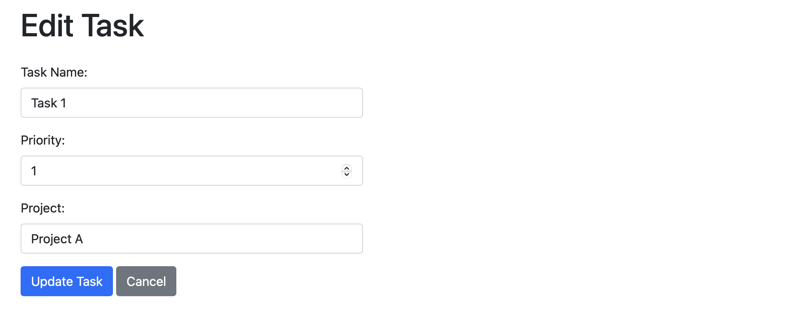

# Laravel Task Management

This is a simple task management application built with Laravel.

## Screenshots




## Getting Started

### Prerequisites

- Docker
- Docker Compose

### Installing

1. Clone the repository:

```bash
git clone https://github.com/yourusername/laravel-task-management.git
```

2. Change into the project directory:

```bash
cd laravel-task-management
```

3. Copy the .env.example file to create a new .env file:

```bash
cp .env.example .env
```

4. Open the .env file and configure the database connection settings:

```bash
DB_CONNECTION=mysql
DB_HOST=mysql
DB_PORT=3306
DB_DATABASE=laravel
DB_USERNAME=sail
DB_PASSWORD=password
```

5. Start Laravel Sail:

```bash
./vendor/bin/sail up -d
```

6. Install Composer dependencies:

```bash
./vendor/bin/sail composer install
```

7. Generate the application key:

```bash
./vendor/bin/sail artisan key:generate
```

8. Run the database migrations:

```bash
./vendor/bin/sail artisan migrate
```

9. Access the application in your browser:

```bash
http://localhost
```

### Usage

Create, edit, delete, and reorder tasks in the task management interface.

### Built With

Laravel
